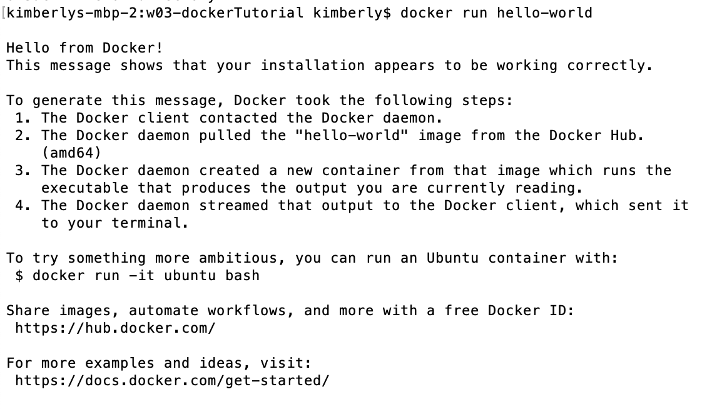
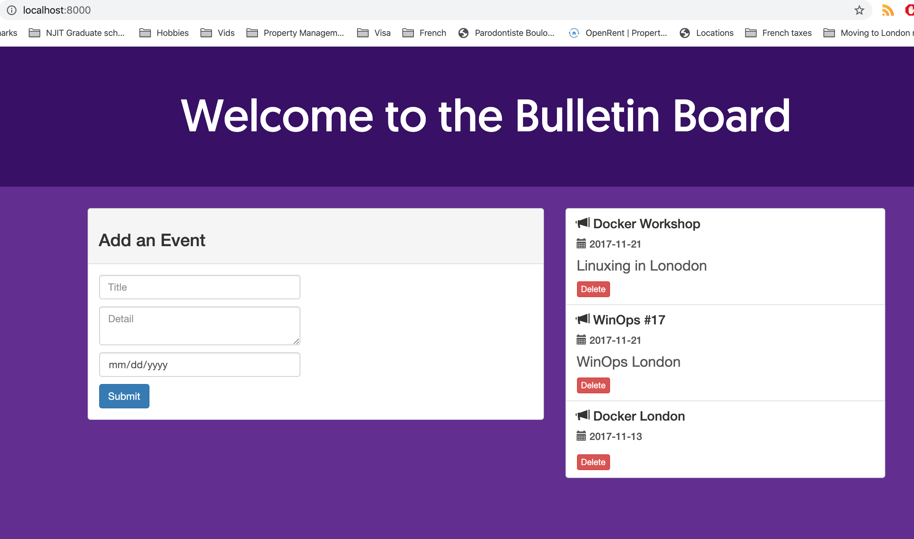
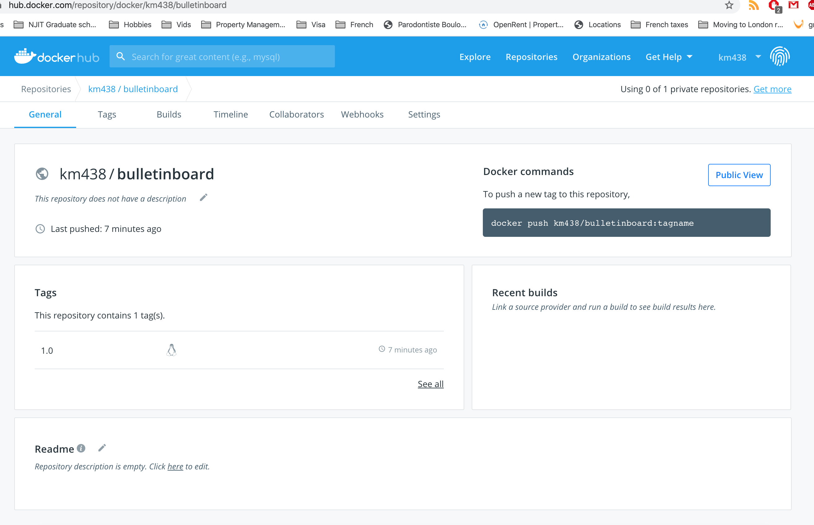

# Docker Tutorial
## Kimberly McDaniel

## Part 1: Orientation and Setup
1. Installed docker on my Mac and tested it with docker --version
2. Tested docker installation via docker run hello-world

## Part 2: Build and run your image
1. Cloned git repository into my repository 
2. Merged the two repositories 
3. Build my docker image with docker image build -t bulletinboard:1.0 .
4. Run my image as a container with docker container run --publish 8000:8080 --detach --name bb bulletinboard:1.0
5. Delete my container docker container rm --force bb

## Part 3: Share images on docker hub
1. Created my docker hub account
2. Created my hub repository and pushed my image docker image tag bulletinboard:1.0 km438/bulletinboard:1.0
3. Pushed my image to docker with docker image push km438/bulletinboard:1.0

 
